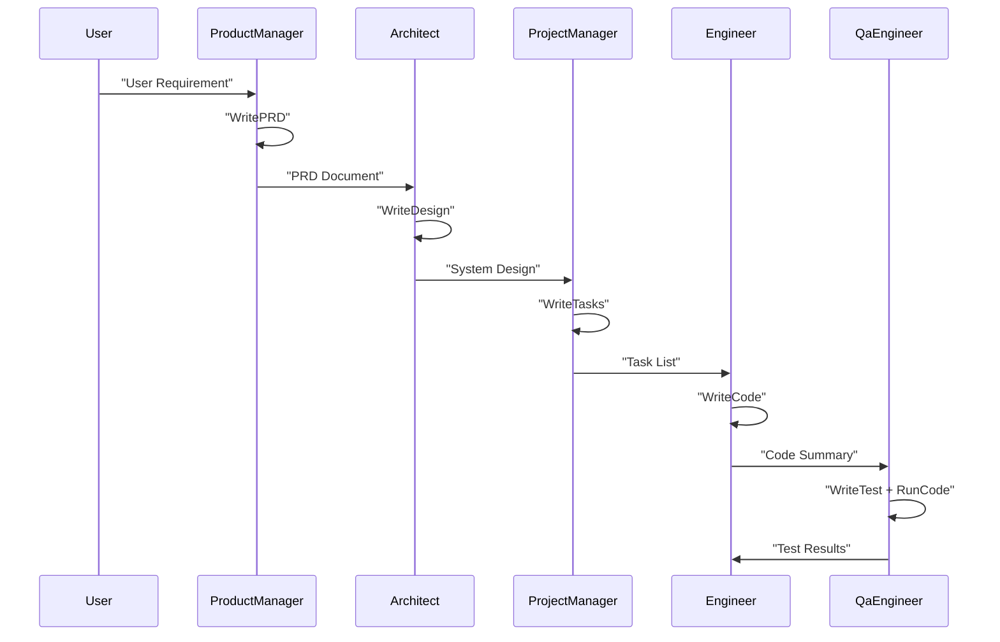
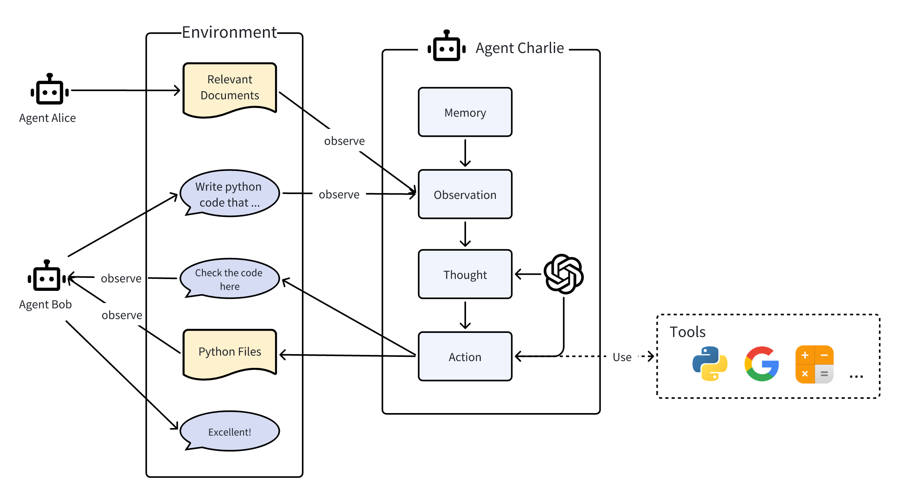
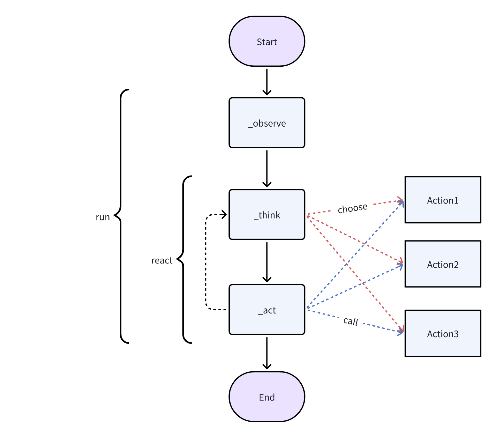
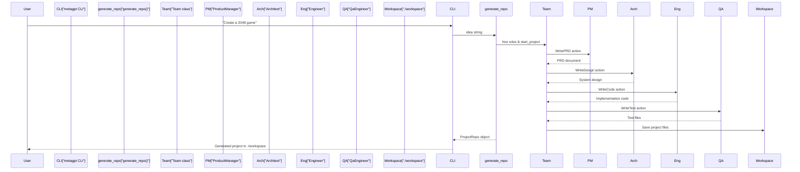

# MetaGPT 调研报告

MetaGPT框架的设计哲学核心可以概括为**"Code = SOP(Team)"**，这一简洁公式深刻揭示了框架如何通过标准化流程协调多智能体团队，最终生成高质量代码的底层逻辑。


## metagpt 核心理念

MetaGPT的创新本质在于将人类组织的分工协作模式系统性地编码到AI智能体的交互中，通过**标准化操作流程（SOP）** 和**角色专业化**解决了传统多智能体系统的协作低效问题。

**核心公式解析：**

- **SOP（标准化操作流程）**：将人类专家在软件开发中的最佳实践抽象并固化为结构化流程，确保任务执行有章可循
- **Team（多智能体团队）**：模拟完整软件公司，由专业角色智能体（产品经理、架构师、工程师等）构成
- **Code（高质量交付物）**：SOP作用于团队的最终产出，通过多角色协同审查和迭代优化保证质量

具体而言，metagpt 框架将多个 agent 进行分工，工作流如下：


## 多智能体交互

### 智能体

学术界和工业界对术语“智能体”提出了各种定义。大致来说，一个智能体应具备类似人类的思考和规划能力，拥有记忆甚至情感，并具备一定的技能以便与环境、智能体和人类进行交互。

在MetaGPT看来，可以将智能体想象成环境中的数字人，其中

> 智能体 = 大语言模型（LLM） + 观察 + 思考 + 行动 + 记忆

这个公式概括了智能体的功能本质。为了理解每个组成部分，让我们将其与人类进行类比：

1. 大语言模型（LLM）：LLM作为智能体的“大脑”部分，使其能够处理信息，从交互中学习，做出决策并执行行动。
2. 观察：这是智能体的感知机制，使其能够感知其环境。智能体可能会接收来自另一个智能体的文本消息、来自监视摄像头的视觉数据或来自客户服务录音的音频等一系列信号。这些观察构成了所有后续行动的基础。
3. 思考：思考过程涉及分析观察结果和记忆内容并考虑可能的行动。这是智能体内部的决策过程，其可能由LLM进行驱动。
4. 行动：这些是智能体对其思考和观察的显式响应。行动可以是利用 LLM 生成代码，或是手动预定义的操作，如阅读本地文件。此外，智能体还可以执行使用工具的操作，包括在互联网上搜索天气，使用计算器进行数学计算等。
5. 记忆：智能体的记忆存储过去的经验。这对学习至关重要，因为它允许智能体参考先前的结果并据此调整未来的行动。

### 多智能体

多智能体系统可以视为一个智能体社会，其中

> 多智能体 = 智能体 + 环境 + 标准流程（SOP） + 通信 + 经济

这些组件各自发挥着重要的作用：

1. 智能体：在上面单独定义的基础上，在多智能体系统中的智能体协同工作，每个智能体都具备独特有的LLM、观察、思考、行动和记忆。
2. 环境：环境是智能体生存和互动的公共场所。智能体从环境中观察到重要信息，并发布行动的输出结果以供其他智能体使用。
3. 标准流程（SOP）：这些是管理智能体行动和交互的既定程序，确保系统内部的有序和高效运作。例如，在汽车制造的SOP中，一个智能体焊接汽车零件，而另一个安装电缆，保持装配线的有序运作。
4. 通信：通信是智能体之间信息交流的过程。它对于系统内的协作、谈判和竞争至关重要。
5. 经济：这指的是多智能体环境中的价值交换系统，决定资源分配和任务优先级。

### 多智能体交互示例

- 在环境中，存在三个智能体Alice、Bob和Charlie，它们相互作用。
- 他们可以将消息或行动的输出结果发布到环境中，同时也会被其他智能体观察到。
- 下面将揭示智能体Charlie的内部过程，该过程同样适用于Alice和Bob。
- 在内部，智能体Charlie具备我们上述所介绍的部分组件，如LLM、观察、思考、行动。Charlie思考和行动的过程可以由LLM驱动，并且还能在行动的过程中使用工具。
- Charlie观察来自Alice的相关文件和来自Bob的需求，获取有帮助的记忆，思考如何编写代码，执行写代码的行动，最终发布结果。
- Charlie通过将结果发布到环境中以通知Bob。Bob在接收后回复了一句赞美的话。



## metagpt 框架设计

### 架构分层概览

**三层架构设计**体现了从需求输入到最终交付的完整流程：

1. **入口层**：提供CLI和程序化接口（如`generate_repo`函数），作为用户与框架交互的起点
2. **核心框架层**：包含团队编排、环境管理、角色系统和动作系统，实现智能体协作的核心逻辑
3. **支撑系统层**：包括LLM集成、配置管理、记忆存储、RAG引擎等基础设施组件

### 核心组件

| 组件类别     | 核心组件                               | 主要职责                                                     |
| ------------ | -------------------------------------- | ------------------------------------------------------------ |
| **团队管理** | Team类、Environment/MGXEnv             | 多智能体协作编排、资源分配、消息路由和通信上下文管理         |
| **角色系统** | Role基类、专业化角色                   | 定义智能体生命周期（`_observe → _think → _act`）、实现角色专业化分工 |
| **动作系统** | Action基类、ActionNode                 | 封装原子任务、通过结构化模板约束LLM输出格式                  |
| **基础设施** | LLM集成层、记忆系统、RAG引擎、配置系统 | 提供模型调用、记忆存储、知识检索、配置管理等基础能力         |

### metagpt 智能体的运行周期：



### 多智能体交互设计

多智能体之间，使用“消息驱动的协作机制”，框架采用**事件驱动架构**实现组件间的松耦合交互：

- **发布-订阅模式**：角色通过`publish_message()`发布事件，通过`_watch()`机制订阅和响应相关事件
- **环境路由**：Environment组件负责消息的路由和过滤，确保信息准确传递
- **异步执行**：支持角色和动作的并行处理，提升整体执行效率

### metagpt 工作流：一句话生成项目



## 代码示例

metagpt 可以开箱即用的运行，也可以通过自定义代码扩展框架。

### 开发基本的智能体

#### 使用现成的智能体

```python
# 可导入任何角色，初始化它，用一个开始的消息运行它，完成！
import asyncio

from metagpt.context import Context
from metagpt.roles.product_manager import ProductManager
from metagpt.logs import logger

async def main():
    msg = "Write a PRD for a snake game"
    context = Context()  # 显式创建会话Context对象，Role对象会隐式的自动将它共享给自己的Action对象
    role = ProductManager(context=context)
    while msg:
        msg = await role.run(msg)
        logger.info(str(msg))

if __name__ == '__main__':
    asyncio.run(main())
```

## 开发具有单一动作的智能体

假设我们想用自然语言编写代码，并想让一个智能体为我们做这件事。让我们称这个智能体为 SimpleCoder，我们需要两个步骤来让它工作：

1. 定义一个编写代码的动作
2. 为智能体配备这个动作

### 定义动作

在 MetaGPT 中，类 `Action` 是动作的逻辑抽象。用户可以通过简单地调用 self._aask 函数令 LLM 赋予这个动作能力，即这个函数将在底层调用 LLM api。

在我们的场景中，我们定义了一个 `SimpleWriteCode` 子类 `Action`。虽然它主要是一个围绕提示和 LLM 调用的包装器，但我们认为这个 `Action` 抽象更直观。在下游和高级任务中，使用它作为一个整体感觉更自然，而不是分别制作提示和调用 LLM，尤其是在智能体的框架内。

```python
from metagpt.actions import Action

class SimpleWriteCode(Action):
    PROMPT_TEMPLATE: str = """
    Write a python function that can {instruction} and provide two runnnable test cases.
    Return ```python your_code_here ``` with NO other texts,
    your code:
    """

    name: str = "SimpleWriteCode"

    async def run(self, instruction: str):
        prompt = self.PROMPT_TEMPLATE.format(instruction=instruction)

        rsp = await self._aask(prompt)

        code_text = SimpleWriteCode.parse_code(rsp)

        return code_text

    @staticmethod
    def parse_code(rsp):
        pattern = r"```python(.*)```"
        match = re.search(pattern, rsp, re.DOTALL)
        code_text = match.group(1) if match else rsp
        return code_text
```

#### 定义角色

在 MetaGPT 中，`Role` 类是智能体的逻辑抽象。一个 `Role` 能执行特定的 `Action`，拥有记忆、思考并采用各种策略行动。基本上，它充当一个将所有这些组件联系在一起的凝聚实体。目前，让我们只关注一个执行动作的智能体，并看看如何定义一个最简单的 `Role`。

在这个示例中，我们创建了一个 `SimpleCoder`，它能够根据人类的自然语言描述编写代码。步骤如下：

1. 我们为其指定一个名称和配置文件。
2. 我们使用 `self._init_action` 函数为其配备期望的动作 `SimpleWriteCode`。
3. 我们覆盖 `_act` 函数，其中包含智能体具体行动逻辑。我们写入，我们的智能体将从最新的记忆中获取人类指令，运行配备的动作，MetaGPT将其作为待办事项 (`self.rc.todo`) 在幕后处理，最后返回一个完整的消息。

```python
from metagpt.roles import Role

class SimpleCoder(Role):
    name: str = "Alice"
    profile: str = "SimpleCoder"

    def __init__(self, **kwargs):
        super().__init__(**kwargs)
        self.set_actions([SimpleWriteCode])

    async def _act(self) -> Message:
        logger.info(f"{self._setting}: to do {self.rc.todo}({self.rc.todo.name})")
        todo = self.rc.todo  # todo will be SimpleWriteCode()

        msg = self.get_memories(k=1)[0]  # find the most recent messages
        code_text = await todo.run(msg.content)
        msg = Message(content=code_text, role=self.profile, cause_by=type(todo))

        return msg
```

#### 运行你的角色

现在我们可以让我们的智能体开始工作，只需初始化它并使用一个起始消息运行它。

```python
import asyncio

from metagpt.context import Context

async def main():
    msg = "write a function that calculates the sum of a list"
    context = Context()
    role = SimpleCoder(context=context)
    logger.info(msg)
    result = await role.run(msg)
    logger.info(result)

asyncio.run(main)
```

## 具有多个动作的智能体

我们注意到一个智能体能够执行一个动作，但如果只有这些，实际上我们并不需要一个智能体。通过直接运行动作本身，我们可以得到相同的结果。智能体的力量，或者说`Role`抽象的惊人之处，在于动作的组合（以及其他组件，比如记忆，但我们将把它们留到后面的部分）。通过连接动作，我们可以构建一个工作流程，使智能体能够完成更复杂的任务。

假设现在我们不仅希望用自然语言编写代码，而且还希望生成的代码立即执行。一个拥有多个动作的智能体可以满足我们的需求。让我们称之为`RunnableCoder`，一个既写代码又立即运行的`Role`。我们需要两个`Action`：`SimpleWriteCode` 和 `SimpleRunCode`

### 定义动作

首先，定义 `SimpleWriteCode`。我们将重用上面创建的那个。

接下来，定义 `SimpleRunCode`。如前所述，从概念上讲，一个动作可以利用LLM，也可以在没有LLM的情况下运行。在`SimpleRunCode`的情况下，LLM不涉及其中。我们只需启动一个子进程来运行代码并获取结果。我们希望展示的是，对于动作逻辑的结构，我们没有设定任何限制，用户可以根据需要完全灵活地设计逻辑。

```python
class SimpleRunCode(Action):
    name: str = "SimpleRunCode"

    async def run(self, code_text: str):
        result = subprocess.run(["python3", "-c", code_text], capture_output=True, text=True)
        code_result = result.stdout
        logger.info(f"{code_result=}")
        return code_result
```

### 定义角色

与定义单一动作的智能体没有太大不同！让我们来映射一下：

1. 用 `self.set_actions` 初始化所有 `Action`
2. 指定每次 `Role` 会选择哪个 `Action`。我们将 `react_mode` 设置为 "by_order"，这意味着 `Role` 将按照 `self.set_actions` 中指定的顺序执行其能够执行的 `Action`（有关更多讨论，请参见 [思考和行动](https://docs.deepwisdom.ai/main/zh/guide/tutorials/agent_think_act.html)）。在这种情况下，当 `Role` 执行 `_act` 时，`self.rc.todo` 将首先是 `SimpleWriteCode`，然后是 `SimpleRunCode`。
3. 覆盖 `_act` 函数。`Role` 从上一轮的人类输入或动作输出中检索消息，用适当的 `Message` 内容提供当前的 `Action` (`self.rc.todo`)，最后返回由当前 `Action` 输出组成的 `Message`。

```python
class RunnableCoder(Role):
    name: str = "Alice"
    profile: str = "RunnableCoder"

    def __init__(self, **kwargs):
        super().__init__(**kwargs)
        self.set_actions([SimpleWriteCode, SimpleRunCode])
        self._set_react_mode(react_mode="by_order")

    async def _act(self) -> Message:
        logger.info(f"{self._setting}: to do {self.rc.todo}({self.rc.todo.name})")
        # By choosing the Action by order under the hood
        # todo will be first SimpleWriteCode() then SimpleRunCode()
        todo = self.rc.todo

        msg = self.get_memories(k=1)[0]  # find the most k recent messages
        result = await todo.run(msg.content)

        msg = Message(content=result, role=self.profile, cause_by=type(todo))
        self.rc.memory.add(msg)
        return msg
```

#### 运行

完成以上项目，即可初始化它并使用一个起始消息运行它。

```python
import asyncio

from metagpt.context import Context

async def main():
    msg = "write a function that calculates the sum of a list"
    context = Context()
    role = RunnableCoder(context=context)
    logger.info(msg)
    result = await role.run(msg)
    logger.info(result)

asyncio.run(main)
```


## 多智能体入门

总的来说，需要三个步骤来建立团队并使其运作：

1. 定义每个角色能够执行的预期动作
2. 基于标准作业程序（SOP）确保每个角色遵守它。通过使每个角色观察上游的相应输出结果，并为下游发布自己的输出结果，可以实现这一点。
3. 初始化所有角色，创建一个带有环境的智能体团队，并使它们之间能够进行交互。

### 定义动作和角色

定义三个具有各自动作的`Role`：

- `SimpleCoder` 具有 `SimpleWriteCode` 动作，接收用户的指令并编写主要代码
- `SimpleTester` 具有 `SimpleWriteTest` 动作，从 `SimpleWriteCode` 的输出中获取主代码并为其提供测试套件
- `SimpleReviewer` 具有 `SimpleWriteReview` 动作，审查来自 `SimpleWriteTest` 输出的测试用例，并检查其覆盖范围和质量

```python
class SimpleWriteCode(Action):
    PROMPT_TEMPLATE: str = """
    Write a python function that can {instruction}.
    Return ```python your_code_here ``` with NO other texts,
    your code:
    """
    name: str = "SimpleWriteCode"

    async def run(self, instruction: str):
        prompt = self.PROMPT_TEMPLATE.format(instruction=instruction)

        rsp = await self._aask(prompt)

        code_text = parse_code(rsp)

        return code_text
```

```python
class SimpleWriteTest(Action):
    PROMPT_TEMPLATE: str = """
    Context: {context}
    Write {k} unit tests using pytest for the given function, assuming you have imported it.
    Return ```python your_code_here ``` with NO other texts,
    your code:
    """

    name: str = "SimpleWriteTest"

    async def run(self, context: str, k: int = 3):
        prompt = self.PROMPT_TEMPLATE.format(context=context, k=k)

        rsp = await self._aask(prompt)

        code_text = parse_code(rsp)

        return code_text
```

```python
class SimpleWriteReview(Action):
    PROMPT_TEMPLATE: str = """
    Context: {context}
    Review the test cases and provide one critical comments:
    """

    name: str = "SimpleWriteReview"

    async def run(self, context: str):
        prompt = self.PROMPT_TEMPLATE.format(context=context)

        rsp = await self._aask(prompt)

        return rsp
```

#### 定义角色

1. 使用 `set_actions` 为`Role`配备适当的 `Action`，这与设置单智能体相同
2. 多智能体操作逻辑：使`Role` `_watch` 来自用户或其他智能体的重要上游消息

```python
class SimpleCoder(Role):
    name: str = "Alice"
    profile: str = "SimpleCoder"

    def __init__(self, **kwargs):
        super().__init__(**kwargs)
        self._watch([UserRequirement])
        self.set_actions([SimpleWriteCode])
```

1. 使用 `set_actions` 为`SimpleTester`配备 `SimpleWriteTest` 动作

2. 使`Role` `_watch` 来自其他智能体的重要上游消息。回想我们的SOP，`SimpleTester`从 `SimpleCoder` 中获取主代码，这是由 `SimpleWriteCode` 引起的 `Message`。因此，我们添加了 `self._watch([SimpleWriteCode])`

3. 重写 `_act` ，`SimpleTester`将所有记忆用作编写测试用例的上下文，并期望多个测试用例。

```python
class SimpleTester(Role):
    name: str = "Bob"
    profile: str = "SimpleTester"

    def __init__(self, **kwargs):
        super().__init__(**kwargs)
        self.set_actions([SimpleWriteTest])
        self._watch([SimpleWriteCode])
        # self._watch([SimpleWriteCode, SimpleWriteReview])  # feel free to try this too

    async def _act(self) -> Message:
        logger.info(f"{self._setting}: to do {self.rc.todo}({self.rc.todo.name})")
        todo = self.rc.todo

        # context = self.get_memories(k=1)[0].content # use the most recent memory as context
        context = self.get_memories()  # use all memories as context

        code_text = await todo.run(context, k=5)  # specify arguments
        msg = Message(content=code_text, role=self.profile, cause_by=type(todo))

        return msg
```

------

按照相同的过程定义 `SimpleReviewer`：

```python
class SimpleReviewer(Role):
    name: str = "Charlie"
    profile: str = "SimpleReviewer"

    def __init__(self, **kwargs):
        super().__init__(**kwargs)
        self.set_actions([SimpleWriteReview])
        self._watch([SimpleWriteTest])
```

#### 创建一个团队并添加角色

初始化所有角色，设置一个 `Team`，运行 `Team

```python
import fire
import typer
from metagpt.logs import logger
from metagpt.team import Team
app = typer.Typer()

@app.command()
def main(
    idea: str = typer.Argument(..., help="write a function that calculates the product of a list"),
    investment: float = typer.Option(default=3.0, help="Dollar amount to invest in the AI company."),
    n_round: int = typer.Option(default=5, help="Number of rounds for the simulation."),
):
    logger.info(idea)

    team = Team()
    team.hire(
        [
            SimpleCoder(),
            SimpleTester(),
            SimpleReviewer(),
        ]
    )

    team.invest(investment=investment)
    team.run_project(idea)
    await team.run(n_round=n_round)

if __name__ == "__main__":
    fire.Fire(main)
```


