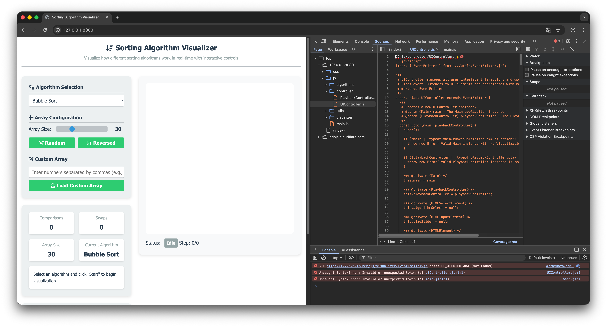
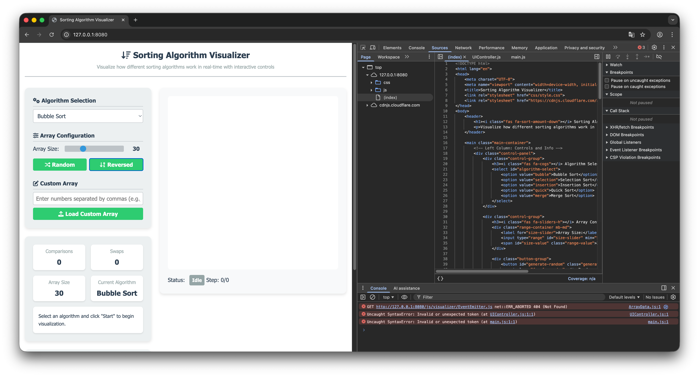
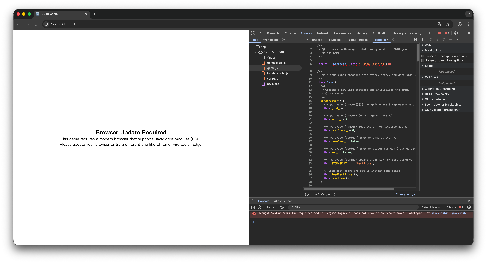

# MetaGPT 实战任务解析

API 模型：deepseek-reasoner （deepseek-v3.2 think）

框架：metagpt 框架，通过 cli 调用

提示词：

```
1. 一个排序算法可视化网页
2. 一个网页版2048小游戏，支持鼠标触控和键盘快捷键
3. 一个简单的多智能体框架（python 语言），使用 openapi 接口调用llm，支持自定义智能体
```

## 项目1：排序可视化

查看生成的文件夹，发现 metagpt 框架创建了（包含非代码文件）的复杂文件结构，但并不是每个文件夹内都有输出。

```
.
├── docs
│   ├── class_view
│   ├── code_plan_and_change
│   ├── code_summary
│   ├── graph_repo
│   ├── prd
│   │   └── 20251217144415.json
│   ├── requirement.txt
│   ├── system_design
│   │   └── 20251217144415.json
│   └── task
│       └── 20251217144415.json
├── requirements.txt
├── resources
│   ├── api_spec_and_task
│   ├── code_plan_and_change
│   ├── code_summary
│   ├── competitive_analysis
│   │   └── 20251217144415.mmd
│   ├── data_api_design
│   │   └── 20251217144415.mmd
│   ├── graph_db
│   ├── prd
│   │   └── 20251217144415.md
│   ├── sd_output
│   ├── seq_flow
│   │   └── 20251217144415.mmd
│   └── system_design
│       └── 20251217144415.md
├── sorting_visualizer
│   ├── css
│   │   └── style.css
│   ├── index.html
│   └── js
│       ├── algorithms
│       │   ├── BubbleSort.js
│       │   ├── InsertionSort.js
│       │   ├── MergeSort.js
│       │   ├── QuickSort.js
│       │   ├── SelectionSort.js
│       │   └── SortingAlgorithm.js
│       ├── controller
│       │   ├── PlaybackController.js
│       │   └── UIController.js
│       ├── main.js
│       ├── utils
│       │   └── EventEmitter.js
│       └── visualizer
│           ├── ArrayData.js
│           └── Visualizer.js
├── test_outputs
└── tests

29 directories, 24 files
```

prd文件

```json
{"Language":"zh_cn","Programming Language":"JavaScript","Original Requirements":"一个排序算法可视化网页","Project Name":"sorting_visualizer","Product Goals":["提供直观、流畅的排序算法执行过程可视化，降低算法学习门槛。","支持多种经典排序算法，允许用户交互式地控制执行步骤与参数。","打造简洁、现代化且响应式的用户界面，确保在不同设备上均有良好体验。"],"User Stories":["作为一名算法初学者，我希望能够可视化地看到冒泡排序的每一步数据交换，以便理解其工作原理。","作为一名计算机科学教师，我希望能在课堂上快速演示并对比不同排序算法（如快速排序与归并排序）的性能，以便生动地教学。","作为一名算法爱好者，我希望可以自由调整数据量大小、动画速度和随机生成数据，以便观察不同条件下算法的表现。","作为一名普通访客，我希望界面清晰易用，无需指导即可开始可视化体验，以便快速获得乐趣和知识。"],"Competitive Analysis":["VisuAlgo：功能强大，涵盖多种算法和数据结构，但界面相对学术化，初学者可能觉得复杂。","Sorting.at：界面非常简洁，专注于排序算法，但可交互性较弱，动画控制选项有限。","visualgo.net：动画流畅，提供详细步骤解释，但页面加载可能较慢，且移动端体验一般。","Algorithm Visualizer：开源项目，支持代码与可视化联动，但部署和界面美观度参差不齐。","经典的“排序算法可视化”个人博客项目：通常功能单一，UI设计较为老旧，且缺乏维护。","CS Academy Sorting Visualizer：交互性好，但主要集成在其教学平台内，非独立产品。","我们的目标产品：计划专注于排序算法，在交互性、UI美观度和响应式设计上寻求平衡。"],"Competitive Quadrant Chart":"quadrantChart\n    title \"排序算法可视化工具竞争分析\"\n    x-axis \"功能复杂度低\" --> \"功能复杂度高\"\n    y-axis \"用户体验差\" --> \"用户体验好\"\n    quadrant-1 \"利基精品\"\n    quadrant-2 \"市场领导者\"\n    quadrant-3 \"有待观察\"\n    quadrant-4 \"大众实用\"\n    \"个人博客项目\": [0.2, 0.3]\n    \"Sorting.at\": [0.3, 0.5]\n    \"我们的目标产品\": [0.6, 0.7]\n    \"Algorithm Visualizer\": [0.7, 0.6]\n    \"CS Academy\": [0.5, 0.65]\n    \"visualgo.net\": [0.8, 0.7]\n    \"VisuAlgo\": [0.9, 0.6]","Requirement Analysis":"核心需求是创建一个用于教育和演示的网页工具，将抽象排序算法的执行过程（如比较、交换、分区）通过图形（如条形图、颜色变化）实时动画化。关键功能模块包括：1) 算法库：实现多种经典排序算法（如冒泡、选择、插入、归并、快速、堆排序）。2) 数据管理：支持生成随机、近乎有序、逆序等不同初始状态的数组。3) 可视化引擎：将数组元素映射为可动态变化高度的条形图，并使用颜色高亮当前操作的元素。4) 播放控制器：提供开始、暂停、步进、重置、调速等交互控件。5) 信息面板：显示算法名称、当前步骤说明、执行时间、比较次数、交换次数等关键指标。技术栈考虑使用HTML/CSS/JavaScript，可能借助Canvas或SVG进行绘图，并确保UI响应式。","Requirement Pool":[["P0","实现核心可视化画布，能够将数组实时渲染为条形图并高亮变化过程。"],["P0","实现至少三种基本排序算法（如冒泡、选择、插入）的可视化逻辑。"],["P1","提供完整的播放控制器（开始、暂停、步进、重置、调速滑块）。"],["P1","实现数据管理功能（随机生成、自定义数组大小、手动输入数据）。"],["P2","添加更高级的排序算法（如快速排序、归并排序、堆排序）及其可视化。"]],"UI Design draft":"页面采用简洁现代的单列布局。顶部为标题和简介区域。主体分为左右两栏（在移动端变为上下堆叠）。左侧为控制面板：包含算法选择下拉菜单、数据大小滑块、数据生成按钮（随机、反向、自定义）、播放控制按钮组（开始、暂停、下一步、重置）、动画速度滑块。右侧为主要可视化区域：一个醒目的矩形画布，内部将数据绘制为水平排列的彩色条形图，条形高度代表数值，比较或交换时条形会高亮（如变红/变绿）并伴有平滑过渡动画。画布下方或旁边可设置一个信息面板，实时显示当前算法步骤的文字描述和关键统计指标。整体色调以深色背景配亮色图表为主，强调清晰度和科技感。","Anything UNCLEAR":"原始需求未明确指定必须包含哪些具体的排序算法。我们将从最基础的几种开始实现，后续可根据需要扩展。另外，是否需要支持将可视化过程导出为GIF或视频？是否需要提供算法伪代码的同步展示？这些高级功能暂未包含在初始范围，可后续迭代考虑。"}
```

System_design

```json
{"Implementation approach":"我们将构建一个纯客户端的、基于Web的排序算法可视化工具，无需后端。核心是使用原生JavaScript实现排序算法，并在执行过程中暂停以记录每一步的状态（包括数组状态、高亮元素、统计信息）。然后利用HTML5 Canvas API将这些状态渲染为动态的条形图动画。UI将采用现代CSS（如Flexbox/Grid）实现响应式布局。为了代码清晰和可维护性，我们将采用模块化设计，将算法、可视化引擎、控制器和数据管理分离。我们选择Canvas而非SVG是因为它更适合需要频繁重绘的动画场景。考虑到易用性和性能，我们不依赖大型UI框架，仅使用原生JS和CSS。","File list":["index.html","css/style.css","js/main.js","js/algorithms/SortingAlgorithm.js","js/algorithms/BubbleSort.js","js/algorithms/SelectionSort.js","js/algorithms/InsertionSort.js","js/algorithms/QuickSort.js","js/algorithms/MergeSort.js","js/visualizer/Visualizer.js","js/visualizer/ArrayData.js","js/controller/PlaybackController.js","js/controller/UIController.js","js/utils/EventEmitter.js"],"Data structures and interfaces":"\nclassDiagram\n    class EventEmitter {\n        +on(event: string, callback: Function)\n        +emit(event: string, ...args)\n    }\n\n    class ArrayData {\n        -array: number[]\n        -size: number\n        -state: string\n        +generateRandom(size: number)\n        +generateReversed(size: number)\n        +setCustomArray(arr: number[])\n        +getArray(): number[]\n        +getSize(): number\n        +swap(i: number, j: number)\n        +setState(state: string)\n        +getState(): string\n    }\n    EventEmitter <|-- ArrayData\n\n    class SortingAlgorithm {\n        <<abstract>>\n        #data: ArrayData\n        -steps: object[]\n        -comparisons: number\n        -swaps: number\n        +sort(data: ArrayData) object[]\n        #step(description: string, highlights: object[])\n        #compare(i: number, j: number) boolean\n        #swap(i: number, j: number)\n    }\n    EventEmitter <|-- SortingAlgorithm\n\n    class BubbleSort {\n        +sort(data: ArrayData) object[]\n    }\n    class SelectionSort {\n        +sort(data: ArrayData) object[]\n    }\n    class InsertionSort {\n        +sort(data: ArrayData) object[]\n    }\n    class QuickSort {\n        +sort(data: ArrayData) object[]\n        -quickSort(low: number, high: number)\n        -partition(low: number, high: number) number\n    }\n    class MergeSort {\n        +sort(data: ArrayData) object[]\n        -mergeSort(low: number, high: number)\n        -merge(low: number, mid: number, high: number)\n    }\n    SortingAlgorithm <|-- BubbleSort\n    SortingAlgorithm <|-- SelectionSort\n    SortingAlgorithm <|-- InsertionSort\n    SortingAlgorithm <|-- QuickSort\n    SortingAlgorithm <|-- MergeSort\n\n    class Visualizer {\n        -canvas: HTMLCanvasElement\n        -ctx: CanvasRenderingContext2D\n        -barWidth: number\n        -maxBarHeight: number\n        -colors: object\n        +render(array: number[], highlights: object[], stats: object)\n        +clear()\n        -drawBar(x: number, value: number, color: string)\n        -drawStats(stats: object)\n    }\n\n    class PlaybackController {\n        -steps: object[]\n        -currentStep: number\n        -speed: number\n        -timerId: number | null\n        -isPlaying: boolean\n        +loadSteps(steps: object[])\n        +play()\n        +pause()\n        +next()\n        +prev()\n        +reset()\n        +setSpeed(speed: number)\n    }\n    EventEmitter <|-- PlaybackController\n\n    class UIController {\n        -algorithmSelect: HTMLSelectElement\n        -sizeSlider: HTMLInputElement\n        -generateButtons: NodeList\n        -playbackButtons: NodeList\n        -speedSlider: HTMLInputElement\n        -infoPanel: HTMLElement\n        +bindEvents()\n        -onAlgorithmChange()\n        -onSizeChange()\n        -onGenerateClick(type: string)\n        -onPlaybackClick(action: string)\n        -onSpeedChange()\n        -updateInfoPanel(step: object)\n    }\n\n    class Main {\n        -arrayData: ArrayData\n        -currentAlgorithm: SortingAlgorithm\n        -visualizer: Visualizer\n        -playbackController: PlaybackController\n        -uiController: UIController\n        +init()\n        -runVisualization()\n    }\n    Main --> ArrayData\n    Main --> SortingAlgorithm\n    Main --> Visualizer\n    Main --> PlaybackController\n    Main --> UIController\n    PlaybackController --> Visualizer\n    UIController --> Main\n","Program call flow":"\nsequenceDiagram\n    participant U as User\n    participant UI as UIController\n    participant M as Main\n    participant AD as ArrayData\n    participant SA as SortingAlgorithm\n    participant PC as PlaybackController\n    participant V as Visualizer\n\n    Note over U, V: 页面初始化\n    M->>M: init()\n    M->>AD: new ArrayData()\n    M->>AD: generateRandom(默认大小)\n    M->>V: new Visualizer(canvas)\n    M->>PC: new PlaybackController()\n    M->>UI: new UIController()\n    UI->>UI: bindEvents()\n    M->>V: render(初始数组, [], 初始统计)\n\n    Note over U, V: 用户选择算法并点击“开始”\n    U->>UI: 从下拉菜单选择算法\n    UI->>M: onAlgorithmChange()\n    M->>M: 根据选择实例化对应SortingAlgorithm子类\n    U->>UI: 点击“开始”按钮\n    UI->>M: onPlaybackClick('start')\n    M->>M: runVisualization()\n    M->>SA: sort(AD)\n    SA->>AD: getArray()\n    SA->>SA: 执行排序逻辑，通过step()记录每一步\n    SA-->>M: 返回steps数组\n    M->>PC: loadSteps(steps)\n    PC->>PC: 重置状态\n    PC->>PC: play()\n    loop 动画循环\n        PC->>PC: 获取当前step\n        PC->>V: render(step.array, step.highlights, step.stats)\n        PC->>UI: updateInfoPanel(step)\n        PC->>PC: 等待speed毫秒后更新currentStep\n    end\n\n    Note over U, V: 用户交互（例如暂停、调速）\n    U->>UI: 点击“暂停”\n    UI->>PC: pause()\n    PC->>PC: clearTimeout(timerId)\n    U->>UI: 拖动速度滑块\n    UI->>PC: setSpeed(newSpeed)\n\n    Note over U, V: 用户生成新数据\n    U->>UI: 点击“随机生成”\n    UI->>AD: generateRandom(新大小)\n    UI->>M: 触发重置流程\n    M->>PC: reset()\n    M->>V: render(新数组, [], 新统计)\n","Anything UNCLEAR":"需求中未明确说明是否需要实现‘步进’（单步前进/后退）功能的具体交互细节。在我们的设计中，PlaybackController已支持next()和prev()方法，UIController将暴露对应的按钮。另外，关于‘自定义输入数据’的交互形式（如文本框、拖拽）未详细说明，我们将在UI设计中采用一个简单的文本输入框，允许用户输入逗号分隔的数字。"}
```

task

```json
{"Required packages":["No third-party packages required. This is a pure front-end project using native HTML, CSS, and JavaScript."],"Required Other language third-party packages":["No third-party packages required."],"Logic Analysis":[["js/utils/EventEmitter.js","实现事件发射器基类，提供 `on` 和 `emit` 方法。这是 `ArrayData`, `SortingAlgorithm`, `PlaybackController` 等类的基类，用于实现模块间松耦合通信。应首先实现。"],["js/visualizer/ArrayData.js","实现 `ArrayData` 类，继承 `EventEmitter`。管理核心数据数组，提供生成随机、反转、自定义数组以及交换元素等方法。当数组状态变化时会触发事件。这是算法和可视化模块的数据源。"],["js/algorithms/SortingAlgorithm.js","实现抽象的 `SortingAlgorithm` 基类，继承 `EventEmitter`。定义排序算法的通用接口和模板方法。包含 `#step`, `#compare`, `#swap` 等受保护方法用于记录步骤。具体的算法类将继承此类。"],["js/algorithms/BubbleSort.js, SelectionSort.js, InsertionSort.js, QuickSort.js, MergeSort.js","分别实现具体的排序算法类（如 `BubbleSort`），继承 `SortingAlgorithm`。每个类需实现 `sort(data)` 方法，并在算法执行过程中调用 `#step` 来记录每一步的状态（数组快照、高亮索引、统计信息）。这些类不依赖可视化模块，可以并行开发。"],["js/visualizer/Visualizer.js","实现 `Visualizer` 类。负责在 Canvas 上绘制条形图、高亮元素以及统计信息。提供 `render(array, highlights, stats)` 和 `clear()` 方法。它仅依赖 Canvas API，不依赖于具体的算法或控制器。"],["js/controller/PlaybackController.js","实现 `PlaybackController` 类，继承 `EventEmitter`。管理已记录的算法步骤 (`steps`)，控制播放 (`play`, `pause`, `next`, `prev`, `reset`)、速度 (`setSpeed`)。它会调用 `Visualizer.render` 来更新画面。依赖于 `Visualizer`。"],["js/controller/UIController.js","实现 `UIController` 类。负责绑定所有 UI 元素（下拉菜单、滑块、按钮）的事件监听器，并将用户操作（如选择算法、点击开始、调节速度）转发给 `Main` 模块或直接调用其他控制器（如 `PlaybackController`）。依赖于 `Main` 模块来协调。"],["js/main.js","实现 `Main` 类。作为应用程序的入口点和协调中心。在 `init()` 中初始化所有其他模块（`ArrayData`, `Visualizer`, `PlaybackController`, `UIController`），并设置它们之间的关联。包含 `runVisualization()` 方法来触发指定算法的排序和步骤记录，并将步骤加载到 `PlaybackController`。它依赖并聚合了几乎所有其他模块。"],["css/style.css","实现样式表。使用 Flexbox/Grid 进行响应式布局，设计算法选择面板、控制面板、画布区域和信息面板的样式。"],["index.html","主 HTML 文件。包含页面结构：算法选择下拉框、数据生成按钮、数组大小滑块、播放控制按钮、速度滑块、Canvas 元素、信息面板等。需要引入所有 CSS 和 JS 文件。"]],"Task list":["js/utils/EventEmitter.js","js/visualizer/ArrayData.js","css/style.css","index.html","js/algorithms/SortingAlgorithm.js","js/algorithms/BubbleSort.js","js/algorithms/SelectionSort.js","js/algorithms/InsertionSort.js","js/algorithms/QuickSort.js","js/algorithms/MergeSort.js","js/visualizer/Visualizer.js","js/controller/PlaybackController.js","js/controller/UIController.js","js/main.js"],"Full API spec":"","Shared Knowledge":"1. **事件契约**: `ArrayData` 在数据变化后应触发事件（如 `'dataChange'`），`PlaybackController` 在步骤变化后应触发事件（如 `'stepChange'`），以便 `UIController` 或 `Main` 进行更新。\n2. **步骤数据结构**: `SortingAlgorithm#step` 方法记录的每个步骤对象应包含 `{ array: number[], highlights: {index: number, color: string}[], stats: {comparisons: number, swaps: number, description?: string} }`。\n3. **Canvas 坐标计算**: `Visualizer` 需要根据 Canvas 尺寸和数组长度动态计算每个条形 (`bar`) 的宽度和位置。\n4. **模块间引用**: `Main` 类将持有所有核心模块的实例，并通过方法调用或事件监听将它们连接起来。例如，`UIController` 调用 `Main.runVisualization()`，`Main` 调用 `SortingAlgorithm.sort()` 并传递 `ArrayData` 实例。","Anything UNCLEAR":"1. 步进功能的具体交互：已确认 `PlaybackController` 实现 `next()`/`prev()`，`UIController` 将提供对应的‘下一步’、‘上一步’按钮，并在点击时调用这些方法。\n2. 自定义输入数据的交互形式：将按照设计，在 `index.html` 的UI中添加一个文本输入框和一个‘加载自定义数组’按钮。`UIController` 会处理该按钮的点击事件，解析文本框内逗号分隔的数字，并调用 `ArrayData.setCustomArray()` 方法。"}
```

### 产出效果

使用 `http-server` 托管静态网页。使用 chrome 打开网页发现，网页可以看到具体的 UI 框架，但是具体的按钮、算法可视化功能不可用。打开浏览器工具，发现控制台提示报错，具体到对应的 js 文件发现，框架错误的把 markdown 内容写到了具体的 js 文件中。



使用 `http-server` 托管静态网页。使用 chrome 打开网页发现，网页可以看到具体的 UI 框架，但是具体的按钮、算法可视化功能不可用。打开浏览器工具，发现控制台提示报错，具体到对应的 js 文件发现，框架错误的把 markdown 内容写到了具体的 js 文件中。




## 项目 2：2048

托管静态网页，项目完全不可用。其问题与项目 1 遇到的问题基本一致。



## 项目 3：agent 框架


# 框架优缺点分析

MetaGPT 的核心理念是 `Code = SOP(Team)`，在**多角色协作**、**SOP（标准操作流程）**、**软件开发场景**方面有独特优势。其工具推荐、计划管理等功能都是为支持复杂的多 agent 协作而设计的。总体而言，MetaGPT 已经具备了通用 agent 框架的核心能力，其相对"缺失"的部分主要集中在**可观测性、标准化服务接口、第三方集成生态**等工程化和生态建设方面，将 MetaGPT 的 agent 能力支持情况总结成表格如下：

| 核心能力                             | 说明                                  | MetaGPT 支持情况 | 备注                                                         |
| ------------------------------------ | ------------------------------------- | ---------------- | ------------------------------------------------------------ |
| **Tool Calling（工具调用）**         | 调用外部工具和函数的能力              | 已支持           | 包括函数调用、工具注册与执行映射系统                         |
| **Multi-Agent 协作**                 | 多个 Agent 之间的通信和协作           | 已支持           | 通过 Environment 消息总线与 Team 类管理协作                  |
| **ReAct 模式**                       | Reasoning and Acting 的思考‑行动循环  | 已支持           | 提供 react、by_order、plan_and_act 等多种模式                |
| **Memory 管理**                      | 短期和长期记忆管理                    | 已支持           | 支持短期记忆与长期记忆机制                                   |
| **Planning（规划）**                 | 任务分解和规划能力                    | 已支持           | 内置 Planner 组件用于任务规划                                |
| **Streaming（流式输出）**            | 实时流式响应                          | 已支持           | 在多个 provider 中实现流式输出                               |
| **Callback/Hook 机制**               | 监控和扩展钩子                        | 相对薄弱         | 有 ResourceReporter，但缺少标准化、灵活可扩展的 callback handler 系统 |
| **Human‑in‑the‑loop**                | 人机交互能力                          | 已支持           | RoleZero 提供了人机交互方法                                  |
| **可观测性**                         | 完整的追踪和调试系统                  | 相对薄弱         | 缺少完整调用链追踪、性能监控、可视化调试界面等               |
| **工具推荐**                         | 动态推荐合适工具的能力                | 已支持           | MetaGPT 具备动态工具推荐能力，是其特色功能                   |
| **标准化的 Agent‑as‑a‑Service 接口** | 提供标准化服务接口（如 RESTful/gRPC） | 相对薄弱         | 缺少 RESTful/gRPC 封装、服务发现、负载均衡等                 |
| **丰富的第三方集成生态**             | 对向量数据库、外部服务等的集成丰富度  | 相对薄弱         | 集成选择较少，社区插件与工具不够丰富                         |
| **细粒度的权限和安全控制**           | 工具调用权限、访问控制、审计日志等    | 相对薄弱         | 缺少完善的权限管理、敏感信息过滤、审计日志系统               |
